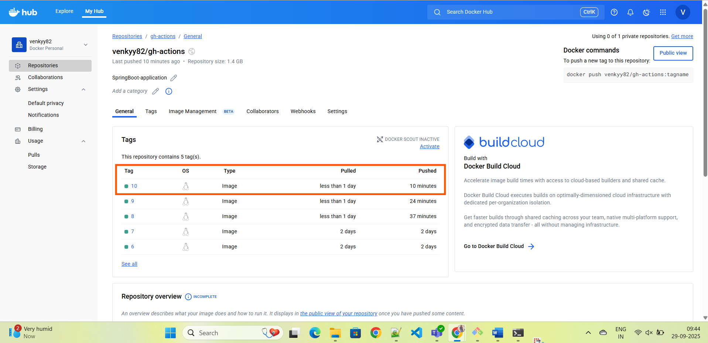
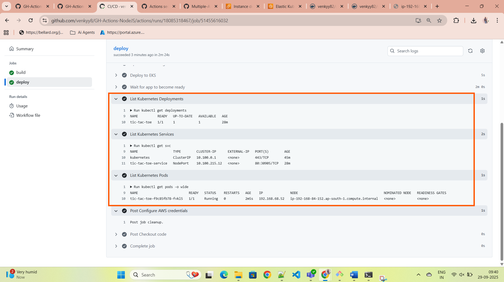
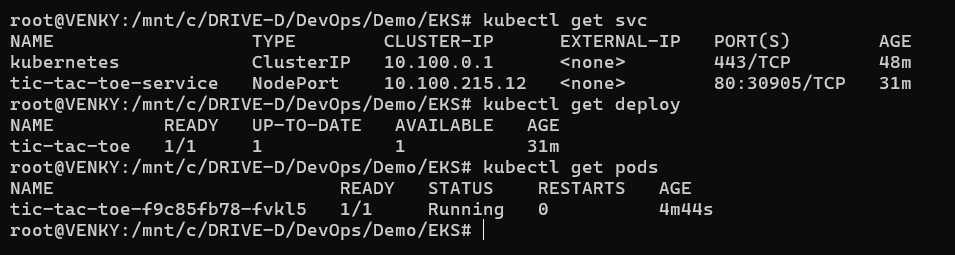
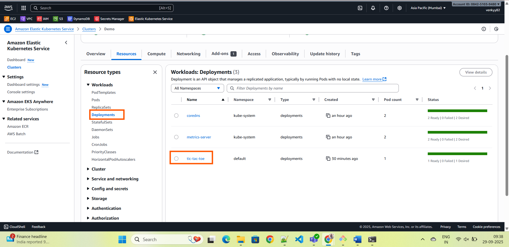

# **TIC-TAC-TOE-GAME**

> **Description**: A brief description of the project Setup

## **Project Setup**

---

## **CI/CD Pipeline**

This repository uses a GitHub Actions CI/CD pipeline to automate the process of building, testing, Scanning, Docker image Building and deploying the application into EKS Cluster. The pipeline is defined in the `.github/workflows/ci-cd.yml` file.

### **Build Job**

1. **Clone the Repository**: The pipeline first checks out the code from the repository.
2. **Install npm dependencies**: It installs necessary npm packages required for the project.
3. **Build the Project**: It runs the `npm run build` command to build the project.
4. **Run Trivy File System Scan**: The pipeline uses [Trivy](https://github.com/aquasecurity/trivy) to perform a security scan on the file system (local codebase) to detect vulnerabilities.
5. **Build Docker Image**: It builds a Docker image of the application.
6. **Run Trivy Docker Image Scan**: The pipeline performs a security scan on the Docker image using Trivy to check for vulnerabilities.
7. **Push Docker Image to Docker Hub**: After the image is built and scanned, it is pushed to Docker Hub with a version tag based on the GitHub `run_number`.
8. **Update Kubernetes Deployment YAML**: The pipeline updates the `deployment-service.yml` file with the newly built Docker image version.
9. **Upload YAML as Artifact**: Finally, the updated deployment YAML is uploaded as an artifact for later use in the deploy job.

### **Deploy Job**

The **deploy** job runs after the build job finishes and performs the following:

1. **Checkout the Code**: It checks out the latest code from the repository.
2. **Download Deployment YAML Artifact**: It downloads the updated `deployment-service.yml` that was generated in the build job.
3. **Configure AWS Credentials**: The job configures AWS credentials using the stored secrets (`AWS_ACCESS_KEY_ID`, `AWS_SECRET_ACCESS_KEY`).
4. **Install kubectl**: It installs `kubectl` to interact with the Kubernetes cluster.
5. **Update kubeconfig for EKS**: It updates the kubeconfig to interact with the EKS cluster.
6. **Deploy to EKS**: It applies the updated deployment YAML to EKS using `kubectl`.
7. **Wait for App to Become Ready**: It waits for the pods to start and become ready (120 seconds).
8. **List Kubernetes Resources**: The pipeline lists the deployments, services, and pods in the Kubernetes cluster to verify that the deployment was successful.

---

## **Environment Variables & Secrets**

For the pipeline to work, the following secrets need to be configured in your GitHub repository under **Settings > Secrets and Variables**:

* **DOCKER_USERNAME**: Docker Hub username.
* **DOCKER_PASSWORD**: Docker Hub password or access token.
* **AWS_ACCESS_KEY_ID**: AWS access key ID with sufficient permissions to interact with EKS.
* **AWS_SECRET_ACCESS_KEY**: AWS secret access key corresponding to the access key ID.

### **Setting Secrets in GitHub**

To add the secrets, go to:

* **Settings** → **Secrets** → **New repository secret**.
* Add the `DOCKER_USERNAME`, `DOCKER_PASSWORD`, `AWS_ACCESS_KEY_ID`, and `AWS_SECRET_ACCESS_KEY` secrets as described above.

---
